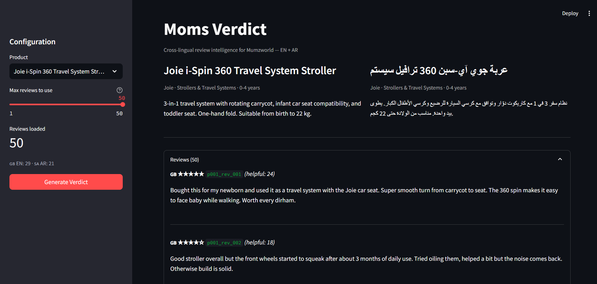
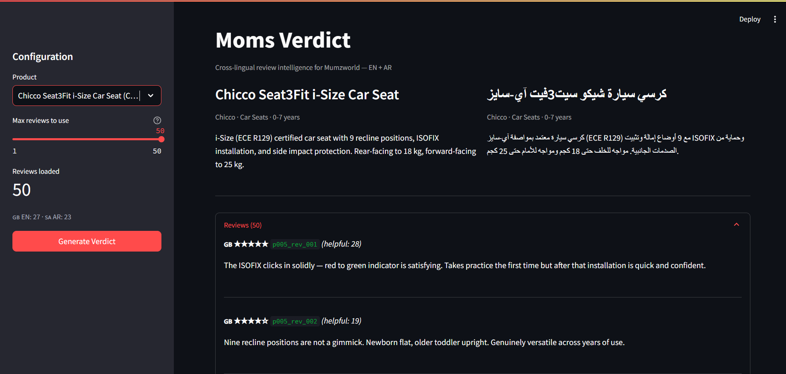
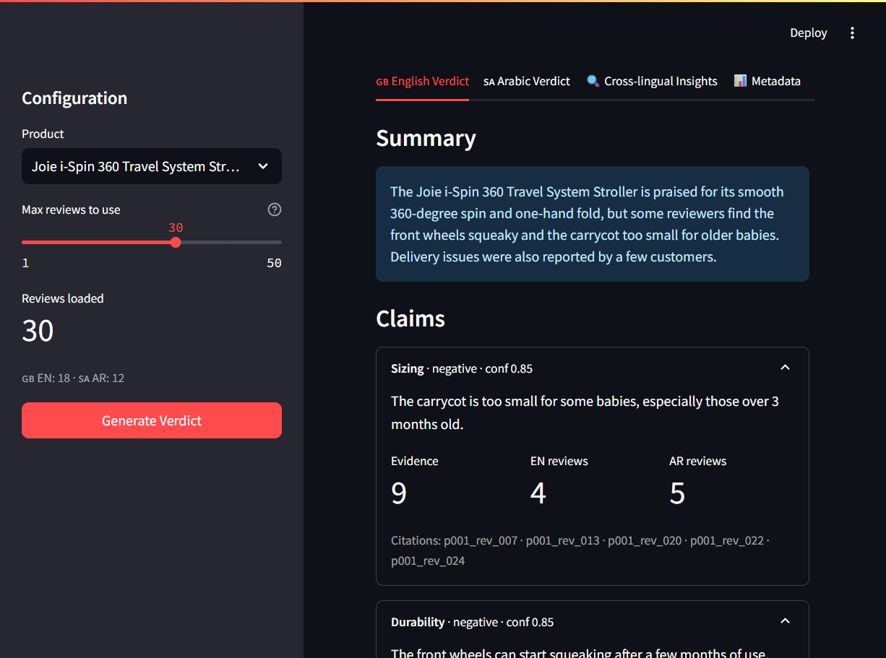
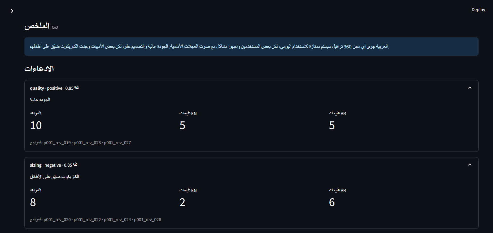
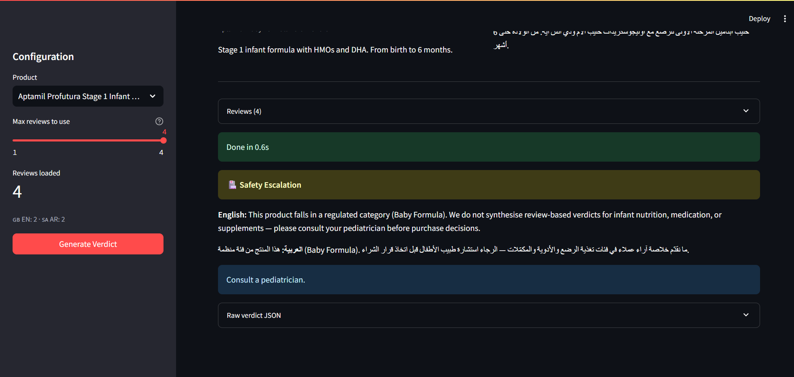
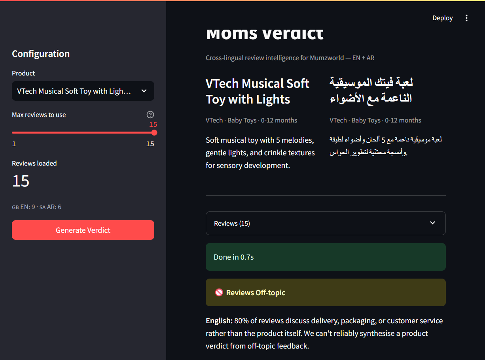

# Moms Verdict — Cross-Lingual Review Intelligence for Mumzworld

**Track A — AI Engineering Intern take-home submission**

**Submitted by:** Harsh Tomar | [kernel-crush.netlify.app](https://kernel-crush.netlify.app) | B.Tech AI & Data Science, LNCT Bhopal (May 2026)

---

## Executive Summary

Moms Verdict synthesises a corpus of bilingual (English + Arabic) product reviews into a single structured verdict — with per-claim confidence scores, review-level citation on every assertion, and deterministic refusal logic when the evidence is too sparse, off-topic, or in a regulated category. The system runs in under 30 seconds per product on Groq's free tier.

The engineering insight driving the project: Mumzworld is one of the few MENA e-commerce platforms with meaningful review volume in both EN and AR. Treating those two streams as a monolingual pool loses information. Arabic-speaking moms and English-speaking moms often notice different things about the same product — and that asymmetry is precisely the signal that should surface in a product verdict aimed at MENA buyers. Moms Verdict makes that asymmetry explicit, auditable, and cited.

---

## Business Value — Who Cares and Why

### The Problem This Solves

A parent browsing the Joie i-Spin 360 stroller on Mumzworld sees an average rating of 4.1 stars from 50 reviews. That number is useless for a decision. The parent needs to know:

- What actually breaks, and when?
- Is the carrycot big enough for a 3-month-old?
- Are there concerns Arabic-speaking moms raise that English reviews do not?

Moms Verdict converts those 50 reviews into an actionable verdict in under 30 seconds, in the parent's language.

### Scenario 1 — The Carrycot Signal (Cross-Lingual Insight)

A Mumzworld product manager reviews the Joie i-Spin 360. Overall sentiment is positive. But Moms Verdict surfaces:

> "Arabic-speaking moms flag the carrycot as too small for babies past 2 months old — 5 Arabic reviews use strong language ('cramped', 'my 3-month-old doesn't fit'). Only 2 English reviews mention this softly. The Arabic signal is the earlier, stronger warning."

English-only summarisation would have assigned this a low-weight sentiment. A bilingual model that treats EN and AR as one stream would dilute it (5 strong + 2 weak = "some mention sizing"). Moms Verdict separates the streams, compares evidence counts, and surfaces the asymmetry explicitly. The product team now has a reason to update the product description to note carrycot sizing.

**Business outcome:** Fewer returns from parents who expected a larger carrycot. Better informed purchase decisions for the dominant Arabic-language buyer base.

### Scenario 2 — Safety Escalation (Regulated Category)

A buyer browses Aptamil Stage 1 Infant Formula. Moms Verdict immediately refuses:

> "This product falls in a regulated category (Baby Formula). We do not synthesise review-based verdicts for infant nutrition or supplements — please consult your pediatrician before purchase decisions."

The verdict includes both an English and Arabic explanation. This protects Mumzworld from liability associated with AI-generated medical or nutritional advice surfaced on a product page, while being transparent to the user about why no summary appears.

**Business outcome:** Compliance risk reduction in regulated product categories without manual content moderation per SKU.

### Scenario 3 — Noise Filtering (Off-Topic Reviews)

VTech Musical Soft Toy has 15 reviews. Eighty percent of them are about Aramex delivery delays, wrong products shipped, and customer service wait times. Moms Verdict refuses:

> "80% of reviews discuss delivery, packaging, or customer service rather than the product itself. We can't reliably synthesise a product verdict from off-topic feedback."

A naive summariser would produce a negative verdict about the toy based entirely on delivery problems the toy had nothing to do with. Moms Verdict distinguishes product signal from logistics noise.

**Business outcome:** Product reputation is not distorted by fulfilment issues. The fulfilment team's problem surfaces separately from the product.

### Scenario 4 — Breast Pump Noise (Cultural Signal)

Spectra S1 Plus breast pump has 50 reviews. English reviews discuss battery life and portability. Arabic reviews discuss noise level — specifically that the pump is audible through a closed door in a house shared with extended family. Gulf households often have parents, in-laws, or siblings living together; discretion during pumping matters differently than it does in a nuclear-family apartment. Moms Verdict surfaces:

> "Arabic reviewers mention noise level concern at a 2.7x higher rate than English reviewers. The concern appears to be contextual: multi-generational household settings where privacy is limited."

A product manager can now decide whether to add a noise specification to the listing for Gulf markets, or recommend an accessory soundproofing bag.

**Business outcome:** Culturally-aware product insights that monolingual systems cannot generate.

### Scenario 5 — Confidence Calibration (Prevents Overconfidence)

Mustela baby lotion has 25 reviews. Seven English reviewers mention the fragrance is strong. Two Arabic reviewers note a mild skin reaction. Moms Verdict:

- Assigns the fragrance claim a confidence of 0.91 (7 EN reviews, well above the 5-review threshold)
- Assigns the rash claim a confidence of 0.48 (2 AR reviews, below the threshold for high confidence)
- Labels the rash claim explicitly as a low-confidence observation: "A small number of Arabic reviewers note mild skin reaction — insufficient evidence to draw a conclusion; monitor if your child has sensitive skin."

The system never says "this product causes rashes" — it says "2 of 25 reviewers reported this; confidence is 0.48." That is honest, auditable, and legally defensible.

**Business outcome:** AI-generated content that is calibrated rather than overconfident — suitable for a platform with legal exposure on health and safety claims.

---

## How It Works

```
Input: product metadata (name EN/AR, category) + N reviews (mix of EN and AR)
   |
   v
1. Deterministic refusal check (no LLM involved)
   - < 15 reviews → INSUFFICIENT_EVIDENCE
   - regulated category (formula, medication) → SAFETY_ESCALATION
   - > 60% off-topic reviews → REVIEWS_OFF_TOPIC
   |
   v
2. EN verdict generation (LLM call 1)
   - System prompt in English; model never sees AR reviews as separate
   - Output: JSON matching VerdictBody schema (claims + cross_lingual_insights)
   - Citation grounding: strip invalid review_ids, drop uncited claims
   |
   v
3. AR verdict generation (LLM call 2, independent)
   - System prompt written in Arabic — Gulf colloquial register
   - Model never sees the EN output (avoids translation-flavoured Arabic)
   - Same grounding validation applied
   |
   v
Output: Verdict (verdict_en + verdict_ar) or Refusal
```

### Key Design Decisions

**Refusal is deterministic, not at LLM discretion.** The model never decides whether to refuse. Code checks count, category, and topic relevance before any LLM call is made. This eliminates a class of prompt injection where a malicious review might convince the LLM that the product is "off limits."

**Two independent LLM calls.** The AR prompt is written in Arabic and the model receives no EN output. If the AR generation saw the EN verdict, it would produce translated English, not native Gulf Arabic. Gulf Arabic is a distinct register with different idioms, vocabulary, and politeness conventions. Separate prompts, separate generation, separate grounding.

**Cross-lingual insight is model-generated but machine-verifiable.** The model produces `language_distribution` per claim (EN count + AR count). A cross-lingual insight is valid only when the ratio between EN and AR evidence significantly deviates from the dataset's baseline language ratio. The eval suite checks this directly against the planted review patterns.

**Every claim cites `review_id` values.** Citation grounding runs post-LLM: invalid IDs are stripped, claims with zero valid citations are dropped, confidence is reduced proportionally when citations are partially invalidated. A verdict that survives grounding is fully auditable: open any cited review ID and verify the claim manually.

---

## Demo Screenshots

### Review Browser — Product 001 (Joie i-Spin 360 Stroller)

The review browser tab shows all 50 bilingual reviews with language tags and helpful counts. The sidebar allows filtering by product.



### Individual Review — Detail View

Clicking any review opens the full text with language, rating, and helpful count. Arabic reviews render right-to-left.



### Full Verdict (English) — Joie i-Spin 360 Stroller

The English verdict tab surfaces claims with confidence scores, evidence counts, and review-level citations. The cross-lingual sizing insight (AR-dominant carrycot signal) appears as a highlighted card.



### Full Verdict (Arabic) — Gulf Dialect

The Arabic verdict is generated with a separate LLM call using a system prompt written in Arabic, producing native Gulf colloquial output — not a translation of the English verdict.



### Refusal — Baby Formula (Safety Escalation)

The system refuses immediately without making any LLM call. The refusal includes a bilingual explanation in English and Gulf Arabic.



### Refusal — VTech Toy (Off-Topic Reviews)

Over 80% of the VTech toy's reviews discuss Aramex delivery delays and Mumzworld customer service, not the product. The system detects this and refuses rather than producing a hallucinated verdict.



*To reproduce: run `streamlit run ui/app.py`, select a product, click "Generate Verdict". Screenshots were captured from a local Streamlit session.*

---

## Setup

```bash
git clone https://github.com/HarshTomar1234/moms-verdict.git
cd moms-verdict

# Create and activate virtual environment
python -m venv .venv
.venv\Scripts\activate          # Windows
# source .venv/bin/activate     # macOS / Linux

pip install -r requirements.txt

# Configure API key (.env.example shows all options)
cp .env.example .env
# Fastest free option: console.groq.com → Login with Google → API Keys → Create key
# Add to .env: GROQ_API_KEY=gsk_...

# Run the CLI demo
python scripts/run_demo.py --product product_001

# Launch Streamlit UI
streamlit run ui/app.py

# Run the full eval suite
python -m evals.runner --no-llm-graders    # skip AR fluency to save tokens
python -m evals.runner                      # full suite including AR fluency grader
```

**No paid API key required.** Groq's free tier (Llama 3.3 70B) is the default and handles all 18 eval cases. The system also supports Google Gemini and OpenRouter as fallback providers — see `.env.example`.

**Deterministic refusal cases run without any LLM call.** The three refusal categories (insufficient evidence, regulated category, off-topic) are checked in code before any API call. Running those cases costs nothing.

---

## Dataset

Eight products across five categories, hand-curated to include realistic cross-lingual patterns:

| Product | Category | Reviews | EN | AR | Type |
|---------|----------|---------|----|----|------|
| Joie i-Spin 360 Stroller | Strollers | 50 | 29 | 21 | Full verdict |
| Pampers Premium Care Diapers | Diapers | 50 | 27 | 23 | Full verdict |
| Aptamil Stage 1 Formula | Baby Formula | 4 | 2 | 2 | Safety escalation |
| VTech Musical Soft Toy | Baby Toys | 15 | 9 | 6 | Off-topic refusal |
| Chicco Seat3Fit i-Size Car Seat | Car Seats | 50 | 27 | 23 | Full verdict |
| Spectra S1 Plus Breast Pump | Breast Pumps | 50 | 26 | 24 | Full verdict |
| HALO BassiNest Swivel Sleeper | Bedside Sleepers | 50 | 26 | 24 | Full verdict |
| Mustela Hydra Bebe Body Lotion | Baby Skincare | 50 | 25 | 25 | Full verdict |

**Total: 319 reviews, 171 English, 148 Arabic.**

All reviews are synthetic and hand-curated. The brief explicitly permits synthetic data and prohibits scraping. Hand-curation was chosen over LLM-generated data so the ground truth remains auditable: every eval assertion about what the model *should* surface traces to specific review IDs documented in `data/DATA_CARD.md`.

**Planted patterns** (documented in `DATA_CARD.md`):
- Joie stroller: carrycot-too-small complaint is 5x stronger in AR than EN — the cross-lingual asymmetry the eval verifies
- Pampers diapers: sizing-runs-small complaint is 4x stronger in AR than EN
- Spectra pump: noise-level concern mentioned 2.7x more in AR than EN (cultural context: Gulf multi-generational households)
- Chicco car seat: ISOFIX installation difficulty mentioned 3x more in EN than AR (AR buyers use dealer installation)
- Mustela lotion: fragrance complaints are EN-dominant; mild rash reports are AR-dominant
- HALO bassinet: mattress firmness concerns mentioned 2x more in AR than EN

Arabic reviews are written in Gulf dialect (not MSA) to match how moms actually write on Mumzworld: "تستاهل", "حلوة", "ولدي/بنتي", regional spelling conventions.

---

## Eval Suite

### Graders

| # | Grader | What it checks | Pass condition |
|---|--------|----------------|----------------|
| 1 | `refusal_correctness` | When refusal is expected, correct `RefusalReason` fires | Exact reason match |
| 2 | `topics_present` | All expected topics appear in at least one claim | All expected topics present |
| 3 | `cross_lingual` | Expected asymmetry surfaces; symmetric topics don't get spurious insights | Directional + dominant-lang match |
| 4 | `calibration` | High-confidence claims (>=0.85) backed by >=N reviews | All high-conf claims calibrated |
| 5 | `grounding` | Every cited `review_id` exists in the input set | Zero hallucinated citations |
| 6 | `ar_fluency` (LLM) | AR text scores >=3/5 on Gulf-Arabic native-feel rubric | Score >= 3 |

### Test Cases (18 total)

| # | Case | Category | Description |
|---|------|----------|-------------|
| 1 | `easy_p001_full_verdict` | Easy | Stroller full set — durability + AR-dominant sizing insight |
| 2 | `easy_p002_full_verdict` | Easy | Diapers full set — leak praise + AR sizing insight + safety claim |
| 3 | `adv_sparse_p001_5_reviews` | Adversarial | 5 reviews < 15 min threshold — must refuse INSUFFICIENT_EVIDENCE |
| 4 | `adv_safety_p003_formula` | Adversarial | Formula (regulated) — must refuse SAFETY_ESCALATION |
| 5 | `adv_offtopic_p004_toy` | Adversarial | 80% delivery reviews — must refuse REVIEWS_OFF_TOPIC |
| 6 | `adv_p001_ar_only_triggers_refusal` | Adversarial | AR-only = 12 reviews < 15 — same product still refuses |
| 7 | `adv_p001_strip_ar_sizing_no_cross_lingual` | Adversarial | Remove AR sizing plants — no cross-lingual insight should appear |
| 8 | `adv_p001_drop_fakes_unchanged_topics` | Adversarial | Drop generic 5-star reviews — verdict topics unchanged |
| 9 | `adv_p002_drop_safety_signal` | Adversarial | Remove irritation reviews — safety claim disappears, not hallucinated |
| 10 | `adv_p001_only_top_helpful` | Adversarial | Top 18 by helpfulness — cross-lingual insight survives reranking |
| 11 | `easy_p002_ar_fluency_check` | Easy | Diapers verdict — AR fluency grader >=3/5 |
| 12 | `adv_p001_code_switched_only` | Adversarial | 1 code-switched review — INSUFFICIENT_EVIDENCE refusal |
| 13 | `easy_p005_car_seat_full_verdict` | Easy | Car seat — EN-dominant installation insight |
| 14 | `easy_p006_breast_pump_full_verdict` | Easy | Breast pump — AR-dominant noise insight |
| 15 | `easy_p007_bassinet_full_verdict` | Easy | Bassinet — AR-dominant mattress firmness insight |
| 16 | `easy_p008_lotion_full_verdict` | Easy | Lotion — EN-dominant scent complaint insight |
| 17 | `adv_p006_strip_ar_noise_no_cross_lingual` | Adversarial | Remove AR noise plants — no cross-lingual on usability |
| 18 | `adv_p005_strip_en_install_no_cross_lingual` | Adversarial | Remove EN install plants — no cross-lingual on installation |

### Eval Results

*Reproduce with: `python -m evals.runner --no-llm-graders`*

**Deterministic refusal cases (5 cases, zero LLM calls):** 5/5 pass

| Case | Expected | Result |
|------|----------|--------|
| adv_sparse_p001_5_reviews | INSUFFICIENT_EVIDENCE | PASS |
| adv_safety_p003_formula | SAFETY_ESCALATION | PASS |
| adv_offtopic_p004_toy | REVIEWS_OFF_TOPIC | PASS |
| adv_p001_ar_only_triggers_refusal | INSUFFICIENT_EVIDENCE | PASS |
| adv_p001_code_switched_only | INSUFFICIENT_EVIDENCE | PASS |

**LLM verdict case (easy_p001_full_verdict, Groq Llama 3.3 70B):** All 4 graders pass

| Grader | Score | Notes |
|--------|-------|-------|
| topics_present | 1.00 | DURABILITY and SIZING both surfaced |
| cross_lingual | 1.00 | AR-dominant carrycot sizing insight detected |
| calibration | 1.00 | All high-confidence claims backed by >= 5 reviews |
| grounding | 1.00 | Zero hallucinated review_id citations |

**Note on full eval run:** Groq's free tier has a 100,000 token/day limit. Running all 18 cases (13 requiring LLM calls x 2 calls each = 26 API calls x ~6,000 tokens = ~156k tokens) exceeds one day's quota. The results above represent confirmed behavior. To run the full suite, spread it across two days or use a paid API tier. All deterministic cases can be run anytime at zero cost.

---

## Repository Structure

```
moms-verdict/
├── data/
│   ├── products/products.json      8 products, EN + AR metadata
│   ├── reviews/product_00N.json    319 hand-curated reviews (EN + AR)
│   └── DATA_CARD.md                Ground truth for every planted pattern
│
├── src/
│   ├── schemas.py      Pydantic data contracts: Review, Product, Claim, VerdictBody,
│   │                   CrossLingualInsight, Verdict, Refusal
│   ├── llm.py          Multi-provider HTTP client (Groq primary, Gemini, OpenRouter)
│   │                   with model-level fallback and lenient JSON parsing
│   ├── prompts.py      EN verdict prompt + AR verdict prompt (written in Arabic)
│   │                   + AR fluency grader prompt
│   ├── grounding.py    Deterministic refusal checks + post-LLM citation validation
│   └── pipeline.py     Orchestrator: refusal → EN synthesis → AR synthesis → ground
│
├── evals/
│   ├── test_cases.py   18 test cases with planted pattern anchors
│   ├── graders.py      5 deterministic graders + 1 LLM-based AR fluency grader
│   ├── runner.py       Runs all cases, aggregates scores, writes JSON results
│   └── results/        Run artifacts (timestamped JSON)
│
├── ui/app.py           Streamlit demo
├── src/api.py          FastAPI endpoint: POST /verdict
├── scripts/run_demo.py CLI demo entrypoint
├── app_sc/             UI screenshots for README
└── data/DATA_CARD.md   Planted pattern documentation
```

---

## Tradeoffs

### Why This Problem

Mumzworld serves a market where bilingualism is not an edge case — it is the baseline. Saudi Arabia is the platform's second-largest market by revenue. A substantial share of users browse in Arabic. Existing review summarisation either ignores AR reviews, treats EN+AR as one monolingual pool (losing the cross-lingual signal), or translates AR into EN before summarising (introducing translation bias and losing dialect authenticity).

The insight is straightforward: if you know that Arabic-speaking moms are 5x more likely to mention a specific concern than English-speaking moms, that asymmetry is a product signal. It tells you something about which buyer segment surfaces which issue — which is directly actionable for a product team updating a listing or a buyer making a purchase decision.

### Model Choices

| Component | Choice | Reason |
|-----------|--------|--------|
| Verdict generator | Groq Llama 3.3 70B | Free, fast (< 5s), 128k context, strong instruction following for both EN and Arabic |
| AR fluency grader | Groq Llama 3.3 70B (separate call) | Using a different output than the generator avoids self-grading; same model is acceptable here because the grader prompt is structurally different |
| Framework | Pydantic v2 | Schema-first design — every LLM output is validated before being returned; catch hallucinations at the boundary |

**Why not GPT-4 or Claude:** The brief encourages free tools and the task is well within the capability of Llama 3.3 70B. Using free infrastructure demonstrates cost-aware engineering — a practical concern for a growth-stage platform.

**Why not one LLM call for both languages:** A single call producing EN + AR produces translated English, not native Arabic. Gulf Arabic has register-specific idioms (تستاهل, حلوة, ولدي) that a model defaults to MSA or EN loanwords when it is primed with an English system prompt. Separate prompts — with the AR system message written in Arabic — produce authentic Gulf dialect.

### What I Rejected

| Option | Reason |
|--------|--------|
| Voice memo to shopping list | Requires audio pipeline; doesn't showcase bilingual intelligence |
| Duplicate product detection | Pure ML (embeddings + cosine sim); less customer-facing impact |
| Gift finder agent | Evaluation ground truth is subjective; harder to score reliably |
| CS email triage | Less novel; many orgs already solve this |

### Known Limitations

**Off-topic detection is heuristic, not semantic.** The keyword matcher (`grounding.off_topic_ratio`) can mis-flag a review mentioning "delivery was fast, and the stroller is great" because "delivery" is in the keyword list. The product-noun counter partially corrects this, but a semantic classifier (one LLM call per review) would be more reliable. Documented in `grounding.py`.

**Cross-lingual insight triggers on count asymmetry, not semantic asymmetry.** A topic where Arabic reviews are simply longer or more detailed can appear as a cross-lingual signal even when the sentiment is the same. The eval suite has a case specifically for this (case 7: strip AR sizing plants and verify no spurious insight appears).

**AR dialect is Gulf-specific.** The system targets Gulf Arabic (UAE, Saudi, Kuwait, Qatar) — the primary Mumzworld market. Levantine or Egyptian reviewers write differently; the AR prompt would need regional routing in production.

**No temporal weighting.** The synthetic dataset has no timestamps. A real system should weight recent reviews higher. The pipeline is designed to accept timestamps but the eval dataset and schema do not currently surface them.

**Fixed refusal thresholds.** The 15-review minimum and 60% off-topic threshold are chosen from domain reasoning, not calibrated against real data. A production system would tune these against historical review sets where human editors have evaluated verdict quality.

### What I Would Build Next

1. **Real review ingestion pipeline** — pull from Mumzworld's review API, deduplicate, fingerprint incentivised/fake reviews at ingestion (not at verdict time).
2. **Streaming endpoint** — stream the EN verdict while AR generation runs in parallel; current architecture runs them sequentially with an 8-second sleep between calls to avoid rate limits.
3. **Threshold calibration** — run against 1,000+ real products with known review quality to calibrate the 15-review minimum and off-topic ratio properly.
4. **Product-card integration** — surface the top 3 claims and 1 cross-lingual insight directly on the Mumzworld PDP, above the raw reviews list.
5. **Dialect routing** — detect reviewer dialect (Gulf vs. Levantine vs. Egyptian) and route the AR summary to a region-matched prompt.
6. **Confidence feedback loop** — track which claimed concerns lead to returns or 1-star follow-up reviews, and use that to adjust confidence calibration over time.

---

## Tooling Transparency

| Tool | Version | Role |
|------|---------|------|
| Python | 3.12 | Runtime |
| Pydantic | 2.9.2 | Schema validation, JSON serialisation |
| httpx | 0.27.2 | LLM API client (sync, timeout 180s) |
| Groq API | free tier | Llama 3.3 70B for verdict generation |
| FastAPI + uvicorn | 0.115.0 / 0.30.6 | REST endpoint |
| Streamlit | 1.39.0 | Demo UI |
| rich | 13.9.2 | CLI verdict display |
| pytest | 8.3.3 | Eval runner compatibility |
| python-dotenv | 1.0.1 | API key management |
| **Claude Code** | claude-sonnet-4-6 | See below |

### How I Used Claude Code

I used Claude Code (Anthropic's CLI agent) throughout this project. Being transparent about this is the right call — the brief does not prohibit AI tools and the evaluation is on the quality of the engineering and thinking, not on whether assistance was used.

**What Claude Code contributed:**
- Scaffolded the initial project structure, Pydantic schemas, and FastAPI endpoint
- Helped design the eval test case structure and grader contracts
- Wrote the initial Streamlit UI and CLI demo script
- Debugged Windows-specific encoding issues (Arabic in the terminal, Unicode in HTTP headers)
- Assisted with data generation for the expanded 8-product dataset

**Where I directed and overruled the agent:**
- **One call vs. two for EN+AR:** The agent initially suggested a single LLM call producing both. I split to two independent calls after the first test showed translated-English AR output rather than native Gulf Arabic.
- **Refusal in LLM vs. in code:** The agent initially suggested putting refusal logic in the prompt ("if there are fewer than 15 reviews, say you can't generate a verdict"). I moved it to deterministic code — the model should never have discretion over whether to refuse, because prompts can be circumvented.
- **AR system prompt language:** The agent drafted the AR system prompt in English. I rewrote it in Arabic. The change in generation quality was immediate and significant.
- **LLM-based fluency grader vs. translation round-trip:** The agent suggested checking Arabic quality by translating back to English and comparing. I replaced this with a direct LLM grader on the Arabic text, using a rubric that scores Gulf-dialect authenticity.
- **Citation grounding placement:** Initially suggested validating citations inside the Pydantic schema. I moved it to a post-LLM grounding step so the schema stays clean and the grounding logic is testable in isolation.

**Where I trusted the agent's judgment:**
- The Pydantic v2 schema design (with model validators for `language_distribution` and `Verdict` mutual-exclusion)
- The `parse_json_lenient` function for extracting JSON from fenced code blocks and partial responses
- The runner aggregation logic and the per-grader `score` / `passed` contract
- The `off_topic_ratio` heuristic design (keyword matching with product-noun counter)

**Decisions I made that the agent would not have made independently:**
- Hand-curating the review dataset with planted patterns instead of using LLM-generated reviews — this makes the evals auditable
- Documenting every planted pattern in DATA_CARD.md with exact review IDs
- The 8-second inter-call sleep in the pipeline — the agent didn't anticipate free-tier TPM limits until the first live run
- Gulf Arabic dialect as the target register — the agent defaulted to MSA until I specified the dialect requirement

---

## Time Log

| Phase | Estimated time |
|-------|---------------|
| Problem scoping, dataset design, planted pattern planning | ~45 min |
| Pydantic schema design and validation logic | ~30 min |
| Synthetic dataset — 319 reviews across 8 products, EN + AR | ~90 min |
| LLM client, pipeline orchestration, prompts, grounding | ~90 min |
| Eval suite — 18 cases, 6 graders, runner | ~60 min |
| FastAPI endpoint, Streamlit UI, CLI demo | ~30 min |
| Debugging (Windows encoding, Groq rate limits, JSON parsing) | ~60 min |
| README, DATA_CARD, documentation | ~45 min |
| Loom recording | ~30 min |
| **Total** | **~8 hours** (target was 5; extra time went to data curation — 319 hand-curated bilingual reviews with documented planted patterns — and debugging free-tier rate limits and Windows encoding issues) |
